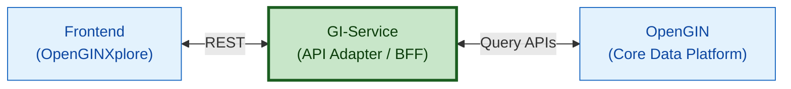

# GI-SERVICE

[](https://opensource.org/licenses/Apache-2.0) 
[](CODE_OF_CONDUCT.md)
[](SECURITY.md)
[](CONTRIBUTING.md)

**General Information Service** is a FastAPI-based backend service that acts as a middle-layer API adapter between **OpenGIN (Open General Information Network)** backend and the **OpenGINXplore** frontend application.

The service is responsible for communicating with OpenGIN APIs, processing and aggregating the retrieved government information, and exposing frontend-friendly endpoints tailored to OpenGINXplore’s data needs. It abstracts the complexity of OpenGIN’s data structures and delivers well-structured, optimized responses for visualization and exploration.

### Data Flow


## Features

<!-- List your project features in a table format -->
| Feature | Description |
|--------|-------------|
| Active Ministries by Date | Provides an API to retrieve the list of ministries that were active on a given date, enabling time-aware views of government structures. |
| Active Departments by Ministry | Exposes endpoints to fetch departments active under a specific ministry for a given date, ensuring historically accurate organizational data. |
| Latest Dataset Access | Supplies various types of datasets (tabular) for the most recent available years, optimized for frontend consumption. |
| Prime Minister & Minister Details | Retrieves active Prime Minister details along with assigned ministers for a specified date, including portfolio associations. |
| Backend for Frontend (BFF) APIs | Acts as a dedicated BFF layer for the frontend, orchestrating parallel API calls to upstream services and returning frontend-ready responses. |


## Getting Started

### Prerequisites

- Python 3.8 to 3.13
- pip (Python package installer)
- Git
- Redis 7+ (optional — only required when `CACHE_ENABLED=true`)

### Installation & Setup

**Clone the Repository**

   ```bash
   git clone https://github.com/LDFLK/GI-SERVICE.git
   cd GI-SERVICE
   ```

### Method 1 (Manual)
1. **Create Virtual Environment**

   ```bash
   # Create virtual environment
   python -m venv .venv

   # Activate virtual environment
   # On Windows:
   .venv\Scripts\activate

   # On macOS/Linux:
   source .venv/bin/activate
   ```

2. **Install Dependencies**

   ```bash
   pip install -r requirements.txt
   ```

3. **Environment Configuration**

   Create a `.env` file in the root directory:

   ```env
   # Base URLs for Read(Query) services in OpenGIN
   BASE_URL_QUERY=http://0.0.0.0:8081
   ALLOWED_ORIGINS=http://localhost:3000

   # Cache (optional — set CACHE_ENABLED=true and start Redis to enable)
   CACHE_ENABLED=false
   REDIS_URL=redis://localhost:6379/0
   ```

4. **Redis (optional — for caching)**

   Caching is **off by default** (`CACHE_ENABLED=false`), so GI-SERVICE runs without Redis for local dev and tests. Enable it when you want response caching and cross-worker lock deduplication (SingleFlight).

   **Install and run Redis locally**

   ```bash
   # macOS (Homebrew)
   brew install redis
   redis-server

   # Ubuntu/Debian
   sudo apt install redis-server
   redis-server

   # Verify Redis is running
   redis-cli ping
   # Expected: PONG
   ```

   Redis runs in the current terminal in the foreground. Stop it with `Ctrl+C`.

   **Enable caching in `.env`**

   ```env
   CACHE_ENABLED=true
   REDIS_URL=redis://localhost:6379/0
   REDIS_MAX_CONNECTIONS=200
   REDIS_POOL_TIMEOUT_SECONDS=5
   CACHE_KEY_PREFIX=gi:v1
   CACHE_TTL_SECONDS=604800
   ```

   Use `localhost` when running GI-SERVICE manually. Docker Compose uses the internal hostname `redis` instead (see Method 2).

   If `CACHE_ENABLED=true` but Redis is not reachable, the app **will fail on startup**. Leave `CACHE_ENABLED=false` to run without Redis.

5. **Run the Application**

   ```bash
   # Development server
   uvicorn main:app --reload --host 0.0.0.0 --port 8000
   ```

   The API will be available at: `http://localhost:8000`

6. **Run Tests & Linting**

   ```bash
   # Run tests
   pytest

   # Check for lint errors
   ruff check .

   # Format code
   ruff format .
   ```

### Method 2 (Docker)

Docker Compose starts **both** GI-SERVICE and Redis. Redis is enabled automatically with `CACHE_ENABLED=true` and `REDIS_URL=redis://redis:6379/0`.

   ```bash
   # Make sure Docker daemon is running

   # Start containers
   docker compose up

   # Build and start containers
   docker compose up --build
   ```

This brings up:

| Service    | URL / Port            |
|------------|-----------------------|
| GI-SERVICE | http://localhost:8000 |
| Redis      | localhost:6379        |

## API Documentation

Once the server is running, you can access:

- **Interactive API Docs**: `http://localhost:8000/docs` (Swagger UI)
- **Alternative Docs**: `http://localhost:8000/redoc` (ReDoc)

## API Endpoints

- Organization Contract: [See Contract](gi_service/contract/rest/organisation_api_contract.yaml)
- Data Contract: [See Contract](gi_service/contract/rest/data_api_contract.yaml)

## Configuration

#### Environment Variables

| Variable | Description | Default |
|----------|-------------|---------|
| `BASE_URL_QUERY` | Query(Read) OpenGIN service URL | `http://0.0.0.0:8081` |
| `ALLOWED_ORIGINS` | Comma-separated list of allowed CORS origins (e.g. `https://example.com,http://localhost:3000`). This must be configured. | `None (required)` |
| `CACHE_ENABLED` | Enable Redis-backed response caching and SingleFlight locks | `false` |
| `REDIS_URL` | Redis connection URL. Use `redis://localhost:6379/0` for manual runs; `redis://redis:6379/0` inside Docker Compose | `""` |
| `REDIS_MAX_CONNECTIONS` | Maximum Redis connections per GI-SERVICE worker before requests wait for a free pooled connection | `200` |
| `REDIS_POOL_TIMEOUT_SECONDS` | How long a Redis operation waits for a pooled connection before failing | `5` |
| `CACHE_KEY_PREFIX` | Prefix for cache keys | `gi:v1` |
| `CACHE_TTL_SECONDS` | Default cache TTL in seconds | `604800` (7 days) |

## Contributing

Please see our [Contributing](CONTRIBUTING.md).

## Code of Conduct

Please see our [Code of Conduct](CODE_OF_CONDUCT.md).

## Security

Please see our [Security Policy](SECURITY.md).

## License

This project is licensed under the Apache License 2.0 - see the [LICENSE](LICENSE) file for details.

## References

- [OpenGIN](https://github.com/LDFLK/OpenGIN) 
- [OpenGINXplore](https://github.com/LDFLK/openginxplore)
